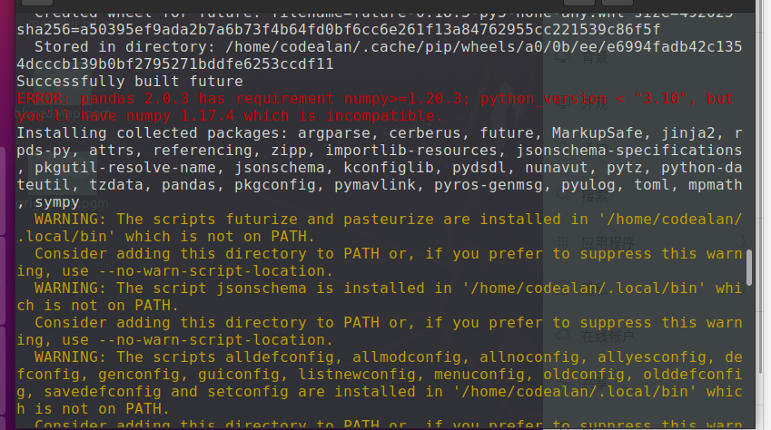
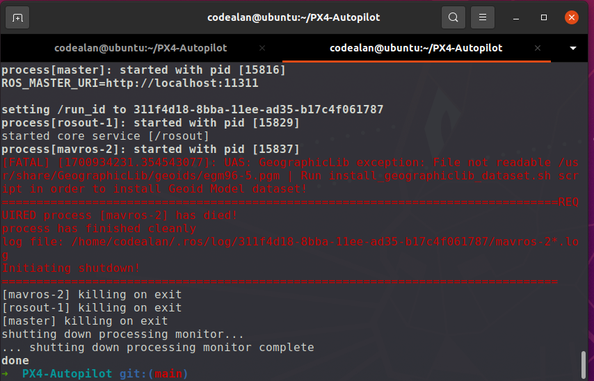

# 无人机仿真Ubuntu20.04+MAVROS+PX4+Gazebo安装教程 


[TOC]

## 安装Ubuntu20.04

略


## 安装ROS Noetic

使用鱼香ROS脚本一键安装，过程简单

[小鱼的一键安装系列 | 鱼香ROS (fishros.org.cn)](https://fishros.org.cn/forum/topic/20/小鱼的一键安装系列?lang=zh-CN)

一键安装指令

```bash
wget http://fishros.com/install -O fishros && . fishros
```


## 安装PX4

从GitHub上拉取源码，文件比较多，时间较长

```bash
git clone https://github.com/PX4/PX4-Autopilot.git --recursive
```


进入PX4-Autopilot文件夹，继续下载未下载完的组件


```bash
cd PX4-Autopilot/
git submodule update --init --recursive
```


继续执行ubuntu.sh脚本，本过程耗时较长

```bash
bash ./PX4-Autopilot/Tools/setup/ubuntu.sh
```


中间出错的话执行指令（视出错类型而定）



我安装过程中出现了这个错误，则只需升级numpy版本即可

```bash
python3 -m pip install --upgrade numpy
```

---


可能要使用的命令

```bash
python3 -m pip install --upgrade pip
python3 -m pip install --upgrade Pillow
python3 -m pip install --upgrade numpy
```


如果过程中有安装失败的地方，可以再用以下命令更新一下，：

```bash
bash ./PX4-Autopilot/Tools/setup/ubuntu.sh --fix-missing
```


完成后重启系统


---

测试

进入你下载的PX4-Autopilot文件夹内，执行以下命令

```bash
make px4_sitl_default gazebo
```


终端输入 commander takeoff ，可以看到无人机起飞

终端输入 commander land ， 可以看到无人机降落


---


添加环境变量（针对Ubuntu20.04）

添加至

```bash
source ~/PX4-Autopilot/Tools/simulation/gazebo-classic/setup_gazebo.bash ~/PX4-Autopilot ~/PX4-Autopilot/build/px4_sitl_default

export ROS_PACKAGE_PATH=$ROS_PACKAGE_PATH:~/PX4-Autopilot

export ROS_PACKAGE_PATH=$ROS_PACKAGE_PATH:~/PX4-Autopilot/Tools/simulation/gazebo-classic/sitl_gazebo-classic
```


## 安装MAVROS


```bash
sudo apt-get install ros-noetic-mavros ros-noetic-mavros-extras
```


运行以下命令测试mavros是否安装成功

```bash
roslaunch mavros px4.launch
```


出现以下报错，则



运行这句命令

```bash
sudo /opt/ros/noetic/lib/mavros/install_geographiclib_datasets.sh
```


## 安装QGC

[Download and Install · QGroundControl User Guide](https://docs.qgroundcontrol.com/master/en/getting_started/download_and_install.html)

QGroundControl* can be installed/run on Ubuntu LTS 20.04 (and later).

Ubuntu comes with a serial modem manager that interferes with any robotics related use of a serial port (or USB serial). Before installing *QGroundControl* you should remove the modem manager and grant yourself permissions to access the serial port. You also need to install *GStreamer* in order to support video streaming.

Before installing *QGroundControl* for the first time:

1. On the command prompt enter:

   ```sh
   sudo usermod -a -G dialout $USER
   sudo apt-get remove modemmanager -y
   sudo apt install gstreamer1.0-plugins-bad gstreamer1.0-libav gstreamer1.0-gl -y
   sudo apt install libqt5gui5 -y
   sudo apt install libfuse2 -y
   ```

2. Logout and login again to enable the change to user permissions.

  To install *QGroundControl*:

1. Download [QGroundControl.AppImage](https://d176tv9ibo4jno.cloudfront.net/latest/QGroundControl.AppImage).

2. Install (and run) using the terminal commands:

   ```sh
   chmod +x ./QGroundControl.AppImage
   ./QGroundControl.AppImage  (or double click)
   ```


##  PX4仿真


添加完环境变量后，可以通过以下命令进行PX4仿真

```bash
roslaunch px4 mavros_posix_sitl.launch
```

该launch文件会启动gazebo、mavros、px4.launch等


查看mavros话题

```bash
rostopic list
```


## 参考文献

- 晨少的bili https://www.bilibili.com/read/cv22962649/

- [小鱼的一键安装系列 | 鱼香ROS (fishros.org.cn)](https://fishros.org.cn/forum/topic/20/小鱼的一键安装系列?lang=zh-CN)

- [使用PX4+mavros+gazebo实现无人机offboard控制仿真_offboard固定机翼控制速度_sdhdwyx的博客-CSDN博客](https://blog.csdn.net/qq_42680785/article/details/118853000)